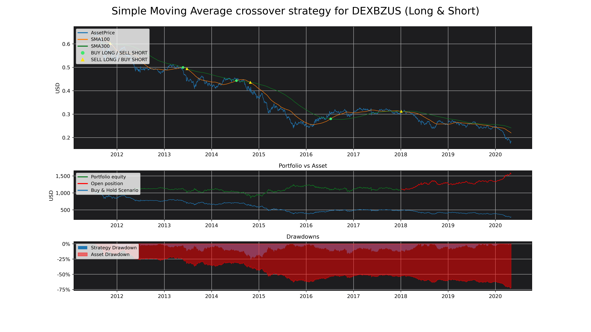

# MA_Backtester

[](https://travis-ci.com/MartinsAlex/MA_Backtester)<space><space>
[](https://snyk.io/test/github/MartinsAlex/MA_Backtester?targetFile=requirements.txt)<space><space>


## Python module allowing you to backtest strategies based on moving averages crossover, on nearly :

* 100'000 stocks
* 120 crypto-currencies
* 23 currencies quoted in USD
* Numerous other assets such as indices, futures and ETFs

<p>&nbsp;</p>

> “ What has happened in the past will happen again. This is because Markets are driven by humans and human nature never changes. “
> > [Jesse Livermore](https://en.wikipedia.org/wiki/Jesse_Lauriston_Livermore)


<p>&nbsp;</p>

# Summary

1. [Installation](https://github.com/MartinsAlex/MA_Backtester/blob/master/README.md#installation)
1. [Utilisation](https://github.com/MartinsAlex/MA_Backtester/blob/master/README.md#utilisation)
    + Examples


&nbsp;

# Installation

```python

pip install https://github.com/MartinsAlex/MA_Backtester/archive/master.zip

```
#### Required modules :

- matplotlib
- pandas
- numpy
- pandas-datareader


&nbsp;

# Utilisation

Arguments, attributes and methods are explained in the class documentation that can be called with the help() built-in function.

```python

import MA_Backtester.analyzer as mb

help(mb)

```
&nbsp;

## Example 1 : SPDR S&P 500 Trust ETF

#### January 2018 to may 2020. Simple moving averages of 20 and 50 days.
- Initial capital : 10'000 USD 
- Short and long positions
- No transaction fees

```python

import MA_Backtester.analyzer as mb
import matplotlib.pyplot as plt


spyStrat = mb.strategyDefiner(["SPY"], 20, 50, "2018-01-01", "2020-05-01", 
                                   maType="simple", plot=True, shortLong="both", capital=10_000)

spyStrat.analyse()


plt.show()


```


```python

spyStrat.resultsTable

```


<table border="1" class="dataframe">
  <thead>
    <tr style="text-align: right;">
      <th></th>
      <th>From</th>
      <th>To</th>
      <th>Ticker</th>
      <th>Number of Trades</th>
      <th>Winning Trades</th>
      <th>Losing Trades</th>
      <th>Largest Winning Trade</th>
      <th>Largest Losing Trade</th>
      <th>Win Rate</th>
      <th>Expectancy</th>
      <th>Total Realized Return</th>
      <th>Total Return</th>
      <th>Buy &amp; Hold Return</th>
      <th>Asset Return %</th>
      <th>Strategy Realized Return %</th>
      <th>Out/Under-performance %</th>
      <th>Asset Annualized Return %</th>
      <th>Strategy Annualized Return %</th>
      <th>Open position (price)</th>
      <th>Open Trade P/L</th>
      <th>Asset Annualized Volatility</th>
      <th>Strategy Annualized Volatility</th>
      <th>Asset Sharpe Ratio</th>
      <th>Strategy Sharpe Ratio</th>
      <th>Asset Max Drawdown</th>
      <th>Strategy Max Drawdown</th>
      <th>Market Exposure</th>
      <th>99 % Strategy Daily VaR</th>
      <th>99 % Asset Daily VaR</th>
      <th>Asset Daily Avg Volume</th>
      <th>Avg Holding Days</th>
      <th>Initial Capital</th>
      <th>Final Capital</th>
      <th>Used Stop-Loss</th>
      <th>Used Take-Profit</th>
      <th>Total fees payed</th>
    </tr>
  </thead>
  <tbody>
    <tr>
      <th>1</th>
      <td>2018-03-15</td>
      <td>2020-05-01</td>
      <td>SPY</td>
      <td>8</td>
      <td>5</td>
      <td>3</td>
      <td>362.394</td>
      <td>-557.371</td>
      <td>0.625</td>
      <td>0.315216</td>
      <td>84.952</td>
      <td>-175.363</td>
      <td>739.807</td>
      <td>0.0739807</td>
      <td>0.0084952</td>
      <td>-0.0654855</td>
      <td>0.0340602</td>
      <td>0.00432461</td>
      <td>289.207</td>
      <td>-260.315</td>
      <td>0.243996</td>
      <td>0.210255</td>
      <td>0.133733</td>
      <td>-0.0598712</td>
      <td>-0.337173</td>
      <td>-0.203692</td>
      <td>0.919926</td>
      <td>0.0307678</td>
      <td>0.0358875</td>
      <td>9.02594e+07</td>
      <td>62</td>
      <td>10000</td>
      <td>9824.64</td>
      <td>0</td>
      <td>0</td>
      <td>0</td>
    </tr>
  </tbody>
</table>


```python

spyStrat.transactionTable

```


<table border="1" class="dataframe">
  <thead>
    <tr style="text-align: right;">
      <th></th>
      <th>Date</th>
      <th>Type</th>
      <th>Price</th>
      <th>Ticker</th>
      <th>P/L</th>
      <th>Number of shares</th>
    </tr>
  </thead>
  <tbody>
    <tr>
      <th>0</th>
      <td>2018-05-15</td>
      <td>Buy Long</td>
      <td>259.473755</td>
      <td>SPY</td>
      <td>NaN</td>
      <td>38</td>
    </tr>
    <tr>
      <th>1</th>
      <td>2018-10-18</td>
      <td>Sell Long</td>
      <td>266.937256</td>
      <td>SPY</td>
      <td>7.463501</td>
      <td>38</td>
    </tr>
    <tr>
      <th>2</th>
      <td>2018-10-18</td>
      <td>Buy Short</td>
      <td>266.937256</td>
      <td>SPY</td>
      <td>NaN</td>
      <td>38</td>
    </tr>
    <tr>
      <th>3</th>
      <td>2019-01-31</td>
      <td>Sell Short</td>
      <td>262.211121</td>
      <td>SPY</td>
      <td>4.726135</td>
      <td>38</td>
    </tr>
    <tr>
      <th>4</th>
      <td>2019-01-31</td>
      <td>Buy Long</td>
      <td>262.211121</td>
      <td>SPY</td>
      <td>NaN</td>
      <td>39</td>
    </tr>
    <tr>
      <th>5</th>
      <td>2019-05-29</td>
      <td>Sell Long</td>
      <td>271.503265</td>
      <td>SPY</td>
      <td>9.292145</td>
      <td>39</td>
    </tr>
    <tr>
      <th>6</th>
      <td>2019-05-29</td>
      <td>Buy Short</td>
      <td>271.503265</td>
      <td>SPY</td>
      <td>NaN</td>
      <td>39</td>
    </tr>
    <tr>
      <th>7</th>
      <td>2019-06-27</td>
      <td>Sell Short</td>
      <td>285.794830</td>
      <td>SPY</td>
      <td>-14.291565</td>
      <td>39</td>
    </tr>
    <tr>
      <th>8</th>
      <td>2019-06-27</td>
      <td>Buy Long</td>
      <td>285.794830</td>
      <td>SPY</td>
      <td>NaN</td>
      <td>35</td>
    </tr>
    <tr>
      <th>9</th>
      <td>2019-08-16</td>
      <td>Sell Long</td>
      <td>283.196716</td>
      <td>SPY</td>
      <td>-2.598114</td>
      <td>35</td>
    </tr>
    <tr>
      <th>10</th>
      <td>2019-08-16</td>
      <td>Buy Short</td>
      <td>283.196716</td>
      <td>SPY</td>
      <td>NaN</td>
      <td>35</td>
    </tr>
    <tr>
      <th>11</th>
      <td>2019-09-18</td>
      <td>Sell Short</td>
      <td>295.206940</td>
      <td>SPY</td>
      <td>-12.010223</td>
      <td>35</td>
    </tr>
    <tr>
      <th>12</th>
      <td>2019-09-18</td>
      <td>Buy Long</td>
      <td>295.206940</td>
      <td>SPY</td>
      <td>NaN</td>
      <td>33</td>
    </tr>
    <tr>
      <th>13</th>
      <td>2020-03-03</td>
      <td>Sell Long</td>
      <td>297.177063</td>
      <td>SPY</td>
      <td>1.970123</td>
      <td>33</td>
    </tr>
    <tr>
      <th>14</th>
      <td>2020-03-03</td>
      <td>Buy Short</td>
      <td>297.177063</td>
      <td>SPY</td>
      <td>NaN</td>
      <td>33</td>
    </tr>
    <tr>
      <th>15</th>
      <td>2020-04-30</td>
      <td>Sell Short</td>
      <td>289.207336</td>
      <td>SPY</td>
      <td>7.969727</td>
      <td>33</td>
    </tr>
    <tr>
      <th>16</th>
      <td>2020-04-30</td>
      <td>Buy Long</td>
      <td>289.207336</td>
      <td>SPY</td>
      <td>NaN</td>
      <td>34</td>
    </tr>
  </tbody>
</table>

--------

&nbsp;


## Example 2 : Crédit Suisse

#### From 2004 to 2015. Weighted Moving Averages of 50 and 200 days.
- Initial capital : 100'000 USD 
- Long only positions
- Stop-loss : 5 %
- Commission : 0.5 %


```python

import MA_Backtester.analyzer as mb
import matplotlib.pyplot as plt

cs_strat = mb.strategyDefiner(["cs"], 50, 200, "2004-01-01", "2015-01-01", 
                                      maType="weighted", plot=True, shortLong="long", capital=100_000,
                                     stopLoss=0.05, commission=0.005)
cs_strat.analyse()

plt.show()

```


```python

cs_strat.resultsTable

```


<table border="1" class="dataframe">
  <thead>
    <tr style="text-align: right;">
      <th></th>
      <th>From</th>
      <th>To</th>
      <th>Ticker</th>
      <th>Number of Trades</th>
      <th>Winning Trades</th>
      <th>Losing Trades</th>
      <th>Largest Winning Trade</th>
      <th>Largest Losing Trade</th>
      <th>Win Rate</th>
      <th>Expectancy</th>
      <th>Total Realized Return</th>
      <th>Total Return</th>
      <th>Buy &amp; Hold Return</th>
      <th>Asset Return %</th>
      <th>Strategy Realized Return %</th>
      <th>Out/Under-performance %</th>
      <th>Asset Annualized Return %</th>
      <th>Strategy Annualized Return %</th>
      <th>Open position (price)</th>
      <th>Open Trade P/L</th>
      <th>Asset Annualized Volatility</th>
      <th>Strategy Annualized Volatility</th>
      <th>Asset Sharpe Ratio</th>
      <th>Strategy Sharpe Ratio</th>
      <th>Asset Max Drawdown</th>
      <th>Strategy Max Drawdown</th>
      <th>Market Exposure</th>
      <th>99 % Strategy Daily VaR</th>
      <th>99 % Asset Daily VaR</th>
      <th>Asset Daily Avg Volume</th>
      <th>Avg Holding Days</th>
      <th>Initial Capital</th>
      <th>Final Capital</th>
      <th>Used Stop-Loss</th>
      <th>Used Take-Profit</th>
      <th>Total fees payed</th>
    </tr>
  </thead>
  <tbody>
    <tr>
      <th>1</th>
      <td>2004-10-19</td>
      <td>2014-12-31</td>
      <td>CS</td>
      <td>9</td>
      <td>5</td>
      <td>4</td>
      <td>62152.1</td>
      <td>-12627.6</td>
      <td>0.5556</td>
      <td>2.47776</td>
      <td>118923</td>
      <td>118923</td>
      <td>2751.17</td>
      <td>0.0275117</td>
      <td>1.18923</td>
      <td>1.16171</td>
      <td>0.00266578</td>
      <td>0.182991</td>
      <td>NaN</td>
      <td>NaN</td>
      <td>0.440157</td>
      <td>0.193793</td>
      <td>0.0028076</td>
      <td>0.37714</td>
      <td>-0.754943</td>
      <td>-0.324068</td>
      <td>0.457376</td>
      <td>0.0286953</td>
      <td>0.0645076</td>
      <td>1.21707e+06</td>
      <td>131</td>
      <td>100000</td>
      <td>218923</td>
      <td>4</td>
      <td>0</td>
      <td>7502.54</td>
    </tr>
  </tbody>
</table>


```python

cs_strat.transactionTable

```


<table border="1" class="dataframe">
  <thead>
    <tr style="text-align: right;">
      <th></th>
      <th>Date</th>
      <th>Type</th>
      <th>Price</th>
      <th>Ticker</th>
      <th>P/L</th>
      <th>Number of shares</th>
    </tr>
  </thead>
  <tbody>
    <tr>
      <th>0</th>
      <td>2004-11-04</td>
      <td>Buy Long</td>
      <td>21.522491</td>
      <td>CS</td>
      <td>NaN</td>
      <td>4646</td>
    </tr>
    <tr>
      <th>1</th>
      <td>2005-06-15</td>
      <td>Sell Long</td>
      <td>24.233398</td>
      <td>CS</td>
      <td>2.710907</td>
      <td>4646</td>
    </tr>
    <tr>
      <th>2</th>
      <td>2005-08-05</td>
      <td>Buy Long</td>
      <td>25.754114</td>
      <td>CS</td>
      <td>NaN</td>
      <td>4352</td>
    </tr>
    <tr>
      <th>3</th>
      <td>2006-07-13</td>
      <td>Sell Long</td>
      <td>33.164829</td>
      <td>CS</td>
      <td>7.410715</td>
      <td>4352</td>
    </tr>
    <tr>
      <th>4</th>
      <td>2006-09-21</td>
      <td>Buy Long</td>
      <td>37.286053</td>
      <td>CS</td>
      <td>NaN</td>
      <td>3856</td>
    </tr>
    <tr>
      <th>5</th>
      <td>2007-07-31</td>
      <td>Sell Long</td>
      <td>41.808239</td>
      <td>CS</td>
      <td>4.522186</td>
      <td>3856</td>
    </tr>
    <tr>
      <th>6</th>
      <td>2009-04-23</td>
      <td>Buy Long</td>
      <td>25.989973</td>
      <td>CS</td>
      <td>NaN</td>
      <td>6175</td>
    </tr>
    <tr>
      <th>7</th>
      <td>2010-01-20</td>
      <td>Sell Long</td>
      <td>33.379612</td>
      <td>CS</td>
      <td>7.389639</td>
      <td>6175</td>
    </tr>
    <tr>
      <th>8</th>
      <td>2010-08-18</td>
      <td>Buy Long</td>
      <td>31.778173</td>
      <td>CS</td>
      <td>NaN</td>
      <td>6461</td>
    </tr>
    <tr>
      <th>9</th>
      <td>2010-09-30</td>
      <td>Stop-Loss Long</td>
      <td>30.001749</td>
      <td>CS</td>
      <td>-1.776424</td>
      <td>6461</td>
    </tr>
    <tr>
      <th>10</th>
      <td>2011-02-01</td>
      <td>Buy Long</td>
      <td>32.158829</td>
      <td>CS</td>
      <td>NaN</td>
      <td>5996</td>
    </tr>
    <tr>
      <th>11</th>
      <td>2011-02-10</td>
      <td>Stop-Loss Long</td>
      <td>30.502254</td>
      <td>CS</td>
      <td>-1.656574</td>
      <td>5996</td>
    </tr>
    <tr>
      <th>12</th>
      <td>2012-03-07</td>
      <td>Buy Long</td>
      <td>18.872923</td>
      <td>CS</td>
      <td>NaN</td>
      <td>9639</td>
    </tr>
    <tr>
      <th>13</th>
      <td>2012-04-26</td>
      <td>Stop-Loss Long</td>
      <td>17.876551</td>
      <td>CS</td>
      <td>-0.996372</td>
      <td>9639</td>
    </tr>
    <tr>
      <th>14</th>
      <td>2012-10-03</td>
      <td>Buy Long</td>
      <td>16.648457</td>
      <td>CS</td>
      <td>NaN</td>
      <td>10296</td>
    </tr>
    <tr>
      <th>15</th>
      <td>2013-12-12</td>
      <td>Sell Long</td>
      <td>22.684988</td>
      <td>CS</td>
      <td>6.036531</td>
      <td>10296</td>
    </tr>
    <tr>
      <th>16</th>
      <td>2014-01-09</td>
      <td>Buy Long</td>
      <td>24.707804</td>
      <td>CS</td>
      <td>NaN</td>
      <td>9418</td>
    </tr>
    <tr>
      <th>17</th>
      <td>2014-01-31</td>
      <td>Stop-Loss Long</td>
      <td>23.367010</td>
      <td>CS</td>
      <td>-1.340794</td>
      <td>9418</td>
    </tr>
  </tbody>
</table>


--------

&nbsp;

## Example 2 : Brazilian Real

#### From may 2015 to may 2020. Simple Moving Averages of 100 and 300 days. 
- Initial capital : 1000 USD
- Short and long positions
- Commission : 0.5 %


```python

import MA_Backtester.analyzer as mb
import matplotlib.pyplot as plt

brazilStrat = mb.strategyDefiner(["DEXBZUS"], 100, 300, "2010-05-01", "2020-05-01", 
                                   shortLong="both", capital=1000, commission=0.005, plot=True)

brazilStrat.analyse()


plt.show()


```




```python

brazilStrat.resultsTable

```


<table border="1" class="dataframe">
  <thead>
    <tr style="text-align: right;">
      <th></th>
      <th>From</th>
      <th>To</th>
      <th>Ticker</th>
      <th>Number of Trades</th>
      <th>Winning Trades</th>
      <th>Losing Trades</th>
      <th>Largest Winning Trade</th>
      <th>Largest Losing Trade</th>
      <th>Win Rate</th>
      <th>Expectancy</th>
      <th>Total Realized Return</th>
      <th>Total Return</th>
      <th>Buy &amp; Hold Return</th>
      <th>Asset Return %</th>
      <th>Strategy Realized Return %</th>
      <th>Out/Under-performance %</th>
      <th>Asset Annualized Return %</th>
      <th>Strategy Annualized Return %</th>
      <th>Open position (price)</th>
      <th>Open Trade P/L</th>
      <th>Asset Annualized Volatility</th>
      <th>Strategy Annualized Volatility</th>
      <th>Asset Sharpe Ratio</th>
      <th>Strategy Sharpe Ratio</th>
      <th>Asset Max Drawdown</th>
      <th>Strategy Max Drawdown</th>
      <th>Market Exposure</th>
      <th>99 % Strategy Daily VaR</th>
      <th>99 % Asset Daily VaR</th>
      <th>Asset Daily Avg Volume</th>
      <th>Avg Holding Days</th>
      <th>Initial Capital</th>
      <th>Final Capital</th>
      <th>Used Stop-Loss</th>
      <th>Used Take-Profit</th>
      <th>Total fees payed</th>
    </tr>
  </thead>
  <tbody>
    <tr>
      <th>1</th>
      <td>2011-07-13</td>
      <td>2020-05-01</td>
      <td>DEXBZUS</td>
      <td>6</td>
      <td>3</td>
      <td>3</td>
      <td>203.209</td>
      <td>-131.786</td>
      <td>0.5</td>
      <td>0.0132372</td>
      <td>113.405</td>
      <td>566.155</td>
      <td>-713.661</td>
      <td>-0.713661</td>
      <td>0.113405</td>
      <td>0.827066</td>
      <td>-0.133236</td>
      <td>0.0128571</td>
      <td>-0.309847</td>
      <td>458.316</td>
      <td>0.15126</td>
      <td>0.116581</td>
      <td>-0.89029</td>
      <td>0.450935</td>
      <td>-0.72959</td>
      <td>-0.272071</td>
      <td>0.961434</td>
      <td>0.0172988</td>
      <td>0.0216007</td>
      <td>NaN</td>
      <td>256</td>
      <td>1000</td>
      <td>1566.16</td>
      <td>0</td>
      <td>0</td>
      <td>36.6523</td>
    </tr>
  </tbody>
</table>


```python

brazilStrat.transactionTable

```


<table border="1" class="dataframe">
  <thead>
    <tr style="text-align: right;">
      <th></th>
      <th>Date</th>
      <th>Type</th>
      <th>Price</th>
      <th>Ticker</th>
      <th>P/L</th>
      <th>Number of shares</th>
    </tr>
  </thead>
  <tbody>
    <tr>
      <th>0</th>
      <td>2011-11-10</td>
      <td>Buy Short</td>
      <td>0.567312</td>
      <td>DEXBZUS</td>
      <td>NaN</td>
      <td>1762</td>
    </tr>
    <tr>
      <th>1</th>
      <td>2013-05-24</td>
      <td>Sell Short</td>
      <td>0.487424</td>
      <td>DEXBZUS</td>
      <td>0.079887</td>
      <td>1762</td>
    </tr>
    <tr>
      <th>2</th>
      <td>2013-05-24</td>
      <td>Buy Long</td>
      <td>0.487424</td>
      <td>DEXBZUS</td>
      <td>NaN</td>
      <td>2330</td>
    </tr>
    <tr>
      <th>3</th>
      <td>2013-06-25</td>
      <td>Sell Long</td>
      <td>0.450308</td>
      <td>DEXBZUS</td>
      <td>-0.037116</td>
      <td>2330</td>
    </tr>
    <tr>
      <th>4</th>
      <td>2013-06-25</td>
      <td>Buy Short</td>
      <td>0.450308</td>
      <td>DEXBZUS</td>
      <td>NaN</td>
      <td>2317</td>
    </tr>
    <tr>
      <th>5</th>
      <td>2014-07-11</td>
      <td>Sell Short</td>
      <td>0.450450</td>
      <td>DEXBZUS</td>
      <td>-0.000142</td>
      <td>2317</td>
    </tr>
    <tr>
      <th>6</th>
      <td>2014-07-11</td>
      <td>Buy Long</td>
      <td>0.450450</td>
      <td>DEXBZUS</td>
      <td>NaN</td>
      <td>2304</td>
    </tr>
    <tr>
      <th>7</th>
      <td>2014-10-27</td>
      <td>Sell Long</td>
      <td>0.393252</td>
      <td>DEXBZUS</td>
      <td>-0.057199</td>
      <td>2304</td>
    </tr>
    <tr>
      <th>8</th>
      <td>2014-10-27</td>
      <td>Buy Short</td>
      <td>0.393252</td>
      <td>DEXBZUS</td>
      <td>NaN</td>
      <td>2291</td>
    </tr>
    <tr>
      <th>9</th>
      <td>2016-07-08</td>
      <td>Sell Short</td>
      <td>0.304553</td>
      <td>DEXBZUS</td>
      <td>0.088699</td>
      <td>2291</td>
    </tr>
    <tr>
      <th>10</th>
      <td>2016-07-08</td>
      <td>Buy Long</td>
      <td>0.304553</td>
      <td>DEXBZUS</td>
      <td>NaN</td>
      <td>3611</td>
    </tr>
    <tr>
      <th>11</th>
      <td>2018-01-04</td>
      <td>Sell Long</td>
      <td>0.309847</td>
      <td>DEXBZUS</td>
      <td>0.005294</td>
      <td>3611</td>
    </tr>
    <tr>
      <th>12</th>
      <td>2018-01-04</td>
      <td>Buy Short</td>
      <td>0.309847</td>
      <td>DEXBZUS</td>
      <td>NaN</td>
      <td>3593</td>
    </tr>
  </tbody>
</table>


&nbsp;

## Example 4 : Analysis of multiple crypto-currencies

#### Bitcoin, Ethereum, Litecoin, BitcoinCash and XRP. January 2018 to may 2020. Exponential Moving Averages of 8 and 13 days.
- Initial capital : 10'000 USD
- Short and long positions
- Commission : 0.1 %

```python

import MA_Backtester.analyzer as mb
import matplotlib.pyplot as plt

cryptoStrat = mb.strategyDefiner(["BTC-USD", "ETH-USD", "LTC-USD", "BCH-USD", "XRP-USD"], 8, 13, "2018-01-01", "2020-05-01", 
                                   maType="exp", shortLong="both", capital=10_000, commission=0.001)

cryptoStrat.analyse()

cryptoStrat.resultsTable

```


<table border="1" class="dataframe">
  <thead>
    <tr style="text-align: right;">
      <th></th>
      <th>From</th>
      <th>To</th>
      <th>Ticker</th>
      <th>Number of Trades</th>
      <th>Winning Trades</th>
      <th>Losing Trades</th>
      <th>Largest Winning Trade</th>
      <th>Largest Losing Trade</th>
      <th>Win Rate</th>
      <th>Expectancy</th>
      <th>Total Realized Return</th>
      <th>Total Return</th>
      <th>Buy &amp; Hold Return</th>
      <th>Asset Return %</th>
      <th>Strategy Realized Return %</th>
      <th>Out/Under-performance %</th>
      <th>Asset Annualized Return %</th>
      <th>Strategy Annualized Return %</th>
      <th>Open position (price)</th>
      <th>Open Trade P/L</th>
      <th>Asset Annualized Volatility</th>
      <th>Strategy Annualized Volatility</th>
      <th>Asset Sharpe Ratio</th>
      <th>Strategy Sharpe Ratio</th>
      <th>Asset Max Drawdown</th>
      <th>Strategy Max Drawdown</th>
      <th>Market Exposure</th>
      <th>99 % Strategy Daily VaR</th>
      <th>99 % Asset Daily VaR</th>
      <th>Asset Daily Avg Volume</th>
      <th>Avg Holding Days</th>
      <th>Initial Capital</th>
      <th>Final Capital</th>
      <th>Used Stop-Loss</th>
      <th>Used Take-Profit</th>
      <th>Total fees payed</th>
    </tr>
  </thead>
  <tbody>
    <tr>
      <th>1</th>
      <td>2018-01-14</td>
      <td>2020-05-01</td>
      <td>BTC-USD</td>
      <td>35</td>
      <td>12</td>
      <td>23</td>
      <td>8301.64</td>
      <td>-2184.46</td>
      <td>0.3429</td>
      <td>332.38</td>
      <td>17110.1</td>
      <td>26611</td>
      <td>-3473.28</td>
      <td>-0.347328</td>
      <td>1.71101</td>
      <td>2.05834</td>
      <td>-0.169231</td>
      <td>0.589044</td>
      <td>6606.78</td>
      <td>9527.28</td>
      <td>0.801572</td>
      <td>0.472757</td>
      <td>-0.212907</td>
      <td>1.26864</td>
      <td>-0.765788</td>
      <td>-0.396519</td>
      <td>0.935714</td>
      <td>0.0592131</td>
      <td>0.097047</td>
      <td>1.50573e+10</td>
      <td>22</td>
      <td>10000</td>
      <td>36611</td>
      <td>0</td>
      <td>0</td>
      <td>377.575</td>
    </tr>
    <tr>
      <th>2</th>
      <td>2018-01-14</td>
      <td>2020-05-01</td>
      <td>ETH-USD</td>
      <td>49</td>
      <td>17</td>
      <td>32</td>
      <td>7059.67</td>
      <td>-2063.92</td>
      <td>0.3469</td>
      <td>8.30164</td>
      <td>13810.2</td>
      <td>25213.8</td>
      <td>-8424.57</td>
      <td>-0.842457</td>
      <td>1.38102</td>
      <td>2.22348</td>
      <td>-0.552028</td>
      <td>0.463143</td>
      <td>145.219</td>
      <td>11427.3</td>
      <td>1.01421</td>
      <td>0.772185</td>
      <td>-0.545703</td>
      <td>0.946049</td>
      <td>-0.938316</td>
      <td>-0.600994</td>
      <td>0.990476</td>
      <td>0.0960317</td>
      <td>0.121271</td>
      <td>6.27324e+09</td>
      <td>16</td>
      <td>10000</td>
      <td>35213.8</td>
      <td>0</td>
      <td>0</td>
      <td>522.029</td>
    </tr>
    <tr>
      <th>3</th>
      <td>2018-01-14</td>
      <td>2020-05-01</td>
      <td>LTC-USD</td>
      <td>37</td>
      <td>14</td>
      <td>23</td>
      <td>31715.7</td>
      <td>-14989.2</td>
      <td>0.3784</td>
      <td>6.44984</td>
      <td>58358.1</td>
      <td>68670.9</td>
      <td>-7927.81</td>
      <td>-0.792781</td>
      <td>5.83581</td>
      <td>6.62859</td>
      <td>-0.495371</td>
      <td>1.30995</td>
      <td>42.9372</td>
      <td>10381.2</td>
      <td>1.02758</td>
      <td>0.80506</td>
      <td>-0.483465</td>
      <td>1.22878</td>
      <td>-0.901689</td>
      <td>-0.438626</td>
      <td>0.997619</td>
      <td>0.100744</td>
      <td>0.123153</td>
      <td>2.023e+09</td>
      <td>22</td>
      <td>10000</td>
      <td>78670.9</td>
      <td>0</td>
      <td>0</td>
      <td>1496.06</td>
    </tr>
    <tr>
      <th>4</th>
      <td>2018-01-14</td>
      <td>2020-05-01</td>
      <td>BCH-USD</td>
      <td>37</td>
      <td>18</td>
      <td>19</td>
      <td>21496.5</td>
      <td>-9968.92</td>
      <td>0.4865</td>
      <td>53.035</td>
      <td>38682</td>
      <td>43142</td>
      <td>-8973.97</td>
      <td>-0.897397</td>
      <td>3.8682</td>
      <td>4.7656</td>
      <td>-0.628186</td>
      <td>0.992465</td>
      <td>239.769</td>
      <td>4508.69</td>
      <td>1.2731</td>
      <td>0.961197</td>
      <td>-0.494554</td>
      <td>0.721432</td>
      <td>-0.9697</td>
      <td>-0.532813</td>
      <td>0.997619</td>
      <td>0.118945</td>
      <td>0.15225</td>
      <td>1.47382e+09</td>
      <td>22</td>
      <td>10000</td>
      <td>53142</td>
      <td>0</td>
      <td>0</td>
      <td>1081.43</td>
    </tr>
    <tr>
      <th>5</th>
      <td>2018-01-14</td>
      <td>2020-05-01</td>
      <td>XRP-USD</td>
      <td>32</td>
      <td>16</td>
      <td>16</td>
      <td>5168.84</td>
      <td>-2920.71</td>
      <td>0.5</td>
      <td>0.0160149</td>
      <td>9227.44</td>
      <td>14643.9</td>
      <td>-8796.93</td>
      <td>-0.879693</td>
      <td>0.922744</td>
      <td>1.80244</td>
      <td>-0.601559</td>
      <td>0.34405</td>
      <td>0.174563</td>
      <td>5435.72</td>
      <td>1.01541</td>
      <td>0.778158</td>
      <td>-0.593839</td>
      <td>0.600374</td>
      <td>-0.924975</td>
      <td>-0.532171</td>
      <td>0.960714</td>
      <td>0.0960376</td>
      <td>0.121023</td>
      <td>1.19343e+09</td>
      <td>24</td>
      <td>10000</td>
      <td>24643.9</td>
      <td>0</td>
      <td>0</td>
      <td>422.119</td>
    </tr>
  </tbody>
</table>


## Then find the moving averages allocation that would have produced the best performance :


```python

cryptoStrat.optimize("Out/Under-performance %", fastMaRange= [8, 10],  slowMaRange = [13, 15], type="max")

```
The function returns a pandas dataFrame with all the combinaison tested :


<table border="1" class="dataframe">
  <thead>
    <tr style="text-align: right;">
      <th></th>
      <th>fastMA</th>
      <th>slowMA</th>
      <th>Out/Under-performance %</th>
    </tr>
  </thead>
  <tbody>
    <tr>
      <th>0</th>
      <td>8.0</td>
      <td>13.0</td>
      <td>3.616123</td>
    </tr>
    <tr>
      <th>1</th>
      <td>8.0</td>
      <td>14.0</td>
      <td>3.308991</td>
    </tr>
    <tr>
      <th>2</th>
      <td>8.0</td>
      <td>15.0</td>
      <td>3.318465</td>
    </tr>
    <tr>
      <th>3</th>
      <td>9.0</td>
      <td>13.0</td>
      <td>3.935898</td>
    </tr>
    <tr>
      <th>4</th>
      <td>9.0</td>
      <td>14.0</td>
      <td>4.137380</td>
    </tr>
    <tr>
      <th>5</th>
      <td>9.0</td>
      <td>15.0</td>
      <td>2.990116</td>
    </tr>
    <tr>
      <th>6</th>
      <td>10.0</td>
      <td>13.0</td>
      <td>3.606319</td>
    </tr>
    <tr>
      <th>7</th>
      <td>10.0</td>
      <td>14.0</td>
      <td>2.364461</td>
    </tr>
    <tr>
      <th>8</th>
      <td>10.0</td>
      <td>15.0</td>
      <td>1.848107</td>
    </tr>
  </tbody>
</table>


## Or would have been the less risky :

```python

cryptoStrat.optimize("Strategy Annualized Volatility", fastMaRange= [8, 10],  slowMaRange = [13, 15], type="min")

```


<table border="1" class="dataframe">
  <thead>
    <tr style="text-align: right;">
      <th></th>
      <th>fastMA</th>
      <th>slowMA</th>
      <th>Strategy Annualized Volatility</th>
    </tr>
  </thead>
  <tbody>
    <tr>
      <th>0</th>
      <td>8.0</td>
      <td>13.0</td>
      <td>0.792693</td>
    </tr>
    <tr>
      <th>1</th>
      <td>8.0</td>
      <td>14.0</td>
      <td>0.792056</td>
    </tr>
    <tr>
      <th>2</th>
      <td>8.0</td>
      <td>15.0</td>
      <td>0.789556</td>
    </tr>
    <tr>
      <th>3</th>
      <td>9.0</td>
      <td>13.0</td>
      <td>0.791734</td>
    </tr>
    <tr>
      <th>4</th>
      <td>9.0</td>
      <td>14.0</td>
      <td>0.786863</td>
    </tr>
    <tr>
      <th>5</th>
      <td>9.0</td>
      <td>15.0</td>
      <td>0.793447</td>
    </tr>
    <tr>
      <th>6</th>
      <td>10.0</td>
      <td>13.0</td>
      <td>0.809747</td>
    </tr>
    <tr>
      <th>7</th>
      <td>10.0</td>
      <td>14.0</td>
      <td>0.812042</td>
    </tr>
    <tr>
      <th>8</th>
      <td>10.0</td>
      <td>15.0</td>
      <td>0.792470</td>
    </tr>
  </tbody>
</table>

--------

&nbsp;


