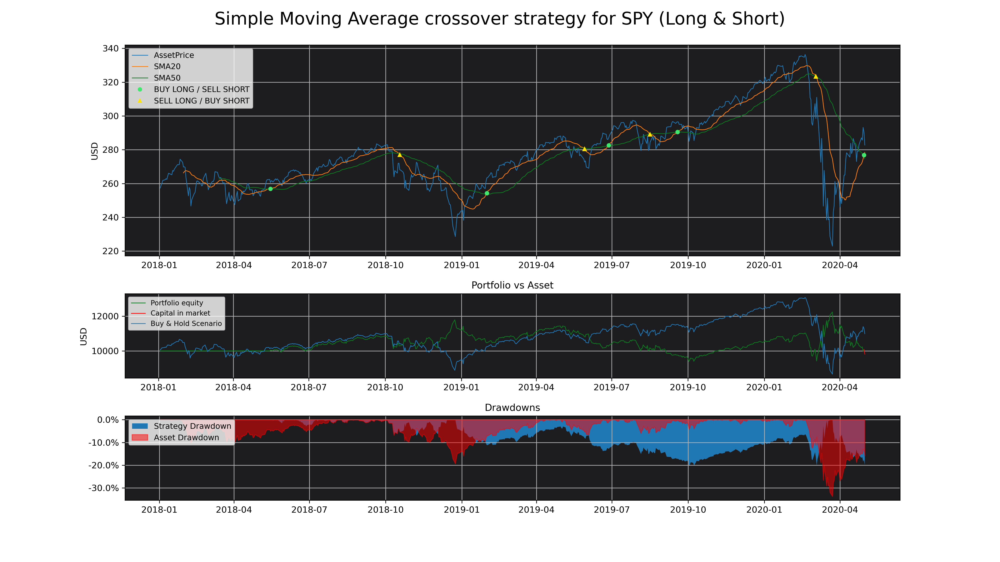
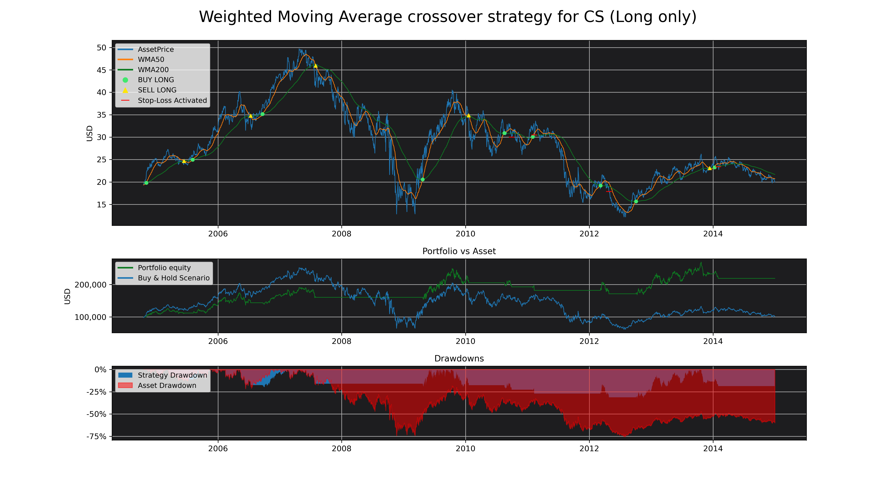

# MA_Backtester

[](https://travis-ci.com/MartinsAlex/MA_Backtester)<space><space>
[](https://snyk.io/test/github/MartinsAlex/MA_Backtester?targetFile=requirements.txt)<space><space>
[](https://www.repostatus.org/#concept)


# This code is still in development and docs will be available in english soon.


### A simple, but powerful, fintech module. It allows to test strategies based on moving averages crossover, on nearly :

* 100'000 stocks
* 120 crypto-currencies
* 23 currencies quoted in USD
* Numerous other assets such as indices, futures and ETFs

<p>&nbsp;</p>

> “ What has happened in the past will happen again. This is because Markets are driven by humans and human nature never changes. “
> > [Jesse Livermore](https://en.wikipedia.org/wiki/Jesse_Lauriston_Livermore)


<p>&nbsp;</p>

# Summary

1. [Installation](https://github.com/MartinsAlex/MA_Backtester/blob/master/README.md#installation)
1. [Utilisation](https://github.com/MartinsAlex/MA_Backtester/blob/master/README.md#utilisation)
    + Examples


&nbsp;

# Installation

```python

pip install https://github.com/MartinsAlex/MA_Backtester/archive/master.zip
    
```
#### Required modules :

- matplotlib
- pandas
- numpy
- pandas-datareader


&nbsp;

# Utilisation

Arguments, attributes and methods are explained in the class documentation that can be called with the help() built-in function.

&nbsp;

## Example 1 : SPDR S&P 500 Trust ETF

#### January 2018 to may 2020. Simple moving averages of 20 and 50 days.
- Initial capital : 10'000 USD 
- Short and long positions
- No transaction fees

```python

import MA_Backtester as mb
import matplotlib.pyplot as plt


spyStrat = mb.movingAverageCrossover(["SPY"], 20, 50, "2018-01-01", "2020-05-01", 
                                   maType="simple", plot=True, shortLong="both", capital=10_000)

spyStrat.analyse()


plt.show()


```




```python

spyStrat.resultsTable

```


<table border="1" class="dataframe">
  <thead>
    <tr style="text-align: right;">
      <th></th>
      <th>From</th>
      <th>To</th>
      <th>Ticker</th>
      <th>Number of Trades</th>
      <th>Winning Trades</th>
      <th>Losing Trades</th>
      <th>Largest Winning Trade</th>
      <th>Largest Losing Trade</th>
      <th>Win Rate</th>
      <th>Expectancy</th>
      <th>Total Realized Return</th>
      <th>Total Return</th>
      <th>Buy &amp; Hold Return</th>
      <th>Asset Return %</th>
      <th>Strategy Realized Return %</th>
      <th>Over/Under-performance %</th>
      <th>Asset Annualized Return %</th>
      <th>Strategy Annualized Return %</th>
      <th>Open position (price)</th>
      <th>Open Trade P/L</th>
      <th>Asset Annualized Volatility</th>
      <th>Strategy Annualized Volatility</th>
      <th>Asset Sharpe Ratio</th>
      <th>Strategy Sharpe Ratio</th>
      <th>Asset Max Drawdown</th>
      <th>Strategy Max Drawdown</th>
      <th>Market Exposure</th>
      <th>Correlation with Hold &amp; Buy</th>
      <th>Asset Daily Avg Volume</th>
      <th>Avg Holding Days</th>
      <th>Initial Capital</th>
      <th>Final Capital</th>
      <th>Used Stop-Loss</th>
      <th>Used Take-Profit</th>
      <th>Total fees payed</th>
    </tr>
  </thead>
  <tbody>
    <tr>
      <th>1</th>
      <td>2018-01-02</td>
      <td>2020-05-01</td>
      <td>SPY</td>
      <td>8</td>
      <td>5</td>
      <td>3</td>
      <td>363.988</td>
      <td>-559.825</td>
      <td>0.625</td>
      <td>0.316589</td>
      <td>75.3385</td>
      <td>-186.122</td>
      <td>988.751</td>
      <td>0.0988751</td>
      <td>0.00753385</td>
      <td>-0.0913412</td>
      <td>0.0413079</td>
      <td>0.00383611</td>
      <td>290.48</td>
      <td>-261.46</td>
      <td>0.240043</td>
      <td>0.190163</td>
      <td>0.163999</td>
      <td>-0.0487639</td>
      <td>-0.337173</td>
      <td>-0.203475</td>
      <td>0.841567</td>
      <td>-0.490094</td>
      <td>9.26934e+07</td>
      <td>62</td>
      <td>10000</td>
      <td>9813.88</td>
      <td>0</td>
      <td>0</td>
      <td>0</td>
    </tr>
  </tbody>
</table>


```python

spyStrat.transactionTable

```


<table border="1" class="dataframe">
  <thead>
    <tr style="text-align: right;">
      <th></th>
      <th>Date</th>
      <th>Type</th>
      <th>Price</th>
      <th>Ticker</th>
      <th>P/L</th>
      <th>Number of shares</th>
    </tr>
  </thead>
  <tbody>
    <tr>
      <th>0</th>
      <td>2018-05-15</td>
      <td>Buy Long</td>
      <td>260.615570</td>
      <td>SPY</td>
      <td>NaN</td>
      <td>38</td>
    </tr>
    <tr>
      <th>1</th>
      <td>2018-10-18</td>
      <td>Sell Long</td>
      <td>268.111938</td>
      <td>SPY</td>
      <td>7.496368</td>
      <td>38</td>
    </tr>
    <tr>
      <th>2</th>
      <td>2018-10-18</td>
      <td>Buy Short</td>
      <td>268.111938</td>
      <td>SPY</td>
      <td>NaN</td>
      <td>38</td>
    </tr>
    <tr>
      <th>3</th>
      <td>2019-01-31</td>
      <td>Sell Short</td>
      <td>263.364990</td>
      <td>SPY</td>
      <td>4.746948</td>
      <td>38</td>
    </tr>
    <tr>
      <th>4</th>
      <td>2019-01-31</td>
      <td>Buy Long</td>
      <td>263.364990</td>
      <td>SPY</td>
      <td>NaN</td>
      <td>39</td>
    </tr>
    <tr>
      <th>5</th>
      <td>2019-05-29</td>
      <td>Sell Long</td>
      <td>272.698029</td>
      <td>SPY</td>
      <td>9.333038</td>
      <td>39</td>
    </tr>
    <tr>
      <th>6</th>
      <td>2019-05-29</td>
      <td>Buy Short</td>
      <td>272.698029</td>
      <td>SPY</td>
      <td>NaN</td>
      <td>39</td>
    </tr>
    <tr>
      <th>7</th>
      <td>2019-06-27</td>
      <td>Sell Short</td>
      <td>287.052521</td>
      <td>SPY</td>
      <td>-14.354492</td>
      <td>39</td>
    </tr>
    <tr>
      <th>8</th>
      <td>2019-06-27</td>
      <td>Buy Long</td>
      <td>287.052521</td>
      <td>SPY</td>
      <td>NaN</td>
      <td>35</td>
    </tr>
    <tr>
      <th>9</th>
      <td>2019-08-16</td>
      <td>Sell Long</td>
      <td>284.442932</td>
      <td>SPY</td>
      <td>-2.609589</td>
      <td>35</td>
    </tr>
    <tr>
      <th>10</th>
      <td>2019-08-16</td>
      <td>Buy Short</td>
      <td>284.442932</td>
      <td>SPY</td>
      <td>NaN</td>
      <td>35</td>
    </tr>
    <tr>
      <th>11</th>
      <td>2019-09-18</td>
      <td>Sell Short</td>
      <td>296.506042</td>
      <td>SPY</td>
      <td>-12.063110</td>
      <td>35</td>
    </tr>
    <tr>
      <th>12</th>
      <td>2019-09-18</td>
      <td>Buy Long</td>
      <td>296.506042</td>
      <td>SPY</td>
      <td>NaN</td>
      <td>32</td>
    </tr>
    <tr>
      <th>13</th>
      <td>2020-03-03</td>
      <td>Sell Long</td>
      <td>298.484802</td>
      <td>SPY</td>
      <td>1.978760</td>
      <td>32</td>
    </tr>
    <tr>
      <th>14</th>
      <td>2020-03-03</td>
      <td>Buy Short</td>
      <td>298.484802</td>
      <td>SPY</td>
      <td>NaN</td>
      <td>32</td>
    </tr>
    <tr>
      <th>15</th>
      <td>2020-04-30</td>
      <td>Sell Short</td>
      <td>290.480011</td>
      <td>SPY</td>
      <td>8.004791</td>
      <td>32</td>
    </tr>
    <tr>
      <th>16</th>
      <td>2020-04-30</td>
      <td>Buy Long</td>
      <td>290.480011</td>
      <td>SPY</td>
      <td>NaN</td>
      <td>34</td>
    </tr>
  </tbody>
</table>

--------

&nbsp;


## Example 2 : Crédit Suisse

#### From 2004 to 2015. Weighted Moving Averages of 50 and 200 days.
- Initial capital : 100'000 USD 
- Long only positions
- Stop-loss : 5 %
- Commission : 0.1 %


```python

import MA_Backtester as mb
import matplotlib.pyplot as plt

cs_strat = mb.movingAverageCrossover(["cs"], 50, 200, "2004-01-01", "2015-01-01", 
                                      maType="weighted", plot=True, shortLong="long", capital=100_000,
                                     stopLoss=0.05, commission=0.001)
cs_strat.analyse()

plt.show()

```


```python

cs_strat.resultsTable

```


<table border="1" class="dataframe">
  <thead>
    <tr style="text-align: right;">
      <th></th>
      <th>From</th>
      <th>To</th>
      <th>Ticker</th>
      <th>Number of Trades</th>
      <th>Winning Trades</th>
      <th>Losing Trades</th>
      <th>Largest Winning Trade</th>
      <th>Largest Losing Trade</th>
      <th>Win Rate</th>
      <th>Expectancy</th>
      <th>Total Realized Return</th>
      <th>Total Return</th>
      <th>Buy &amp; Hold Return</th>
      <th>Asset Return %</th>
      <th>Strategy Realized Return %</th>
      <th>Over/Under-performance %</th>
      <th>Asset Annualized Return %</th>
      <th>Strategy Annualized Return %</th>
      <th>Open position (price)</th>
      <th>Open Trade P/L</th>
      <th>Asset Annualized Volatility</th>
      <th>Strategy Annualized Volatility</th>
      <th>Asset Sharpe Ratio</th>
      <th>Strategy Sharpe Ratio</th>
      <th>Asset Max Drawdown</th>
      <th>Strategy Max Drawdown</th>
      <th>Market Exposure</th>
      <th>Correlation with Hold &amp; Buy</th>
      <th>Asset Daily Avg Volume</th>
      <th>Avg Holding Days</th>
      <th>Initial Capital</th>
      <th>Final Capital</th>
      <th>Used Stop-Loss</th>
      <th>Used Take-Profit</th>
      <th>Total fees payed</th>
    </tr>
  </thead>
  <tbody>
    <tr>
      <th>1</th>
      <td>2004-01-02</td>
      <td>2014-12-31</td>
      <td>CS</td>
      <td>9</td>
      <td>5</td>
      <td>4</td>
      <td>63795</td>
      <td>-13000.3</td>
      <td>0.5556</td>
      <td>2.45572</td>
      <td>126335</td>
      <td>126335</td>
      <td>-7221.31</td>
      <td>-0.0722131</td>
      <td>1.26335</td>
      <td>1.33557</td>
      <td>-0.0067981</td>
      <td>0.19147</td>
      <td>0</td>
      <td>0</td>
      <td>0.429507</td>
      <td>0.185931</td>
      <td>-0.0186348</td>
      <td>0.393765</td>
      <td>-0.754943</td>
      <td>-0.312255</td>
      <td>0.424341</td>
      <td>0.432907</td>
      <td>1.14115e+06</td>
      <td>131</td>
      <td>100000</td>
      <td>226335</td>
      <td>4</td>
      <td>0</td>
      <td>1525.18</td>
    </tr>
  </tbody>
</table>


```python

cs_strat.transactionTable

```


<table border="1" class="dataframe">
  <thead>
    <tr style="text-align: right;">
      <th></th>
      <th>Date</th>
      <th>Type</th>
      <th>Price</th>
      <th>Ticker</th>
      <th>P/L</th>
      <th>Number of shares</th>
    </tr>
  </thead>
  <tbody>
    <tr>
      <th>0</th>
      <td>2004-11-04</td>
      <td>Buy Long</td>
      <td>21.331051</td>
      <td>CS</td>
      <td>NaN</td>
      <td>4688</td>
    </tr>
    <tr>
      <th>1</th>
      <td>2005-06-15</td>
      <td>Sell Long</td>
      <td>24.017841</td>
      <td>CS</td>
      <td>2.686790</td>
      <td>4688</td>
    </tr>
    <tr>
      <th>2</th>
      <td>2005-08-05</td>
      <td>Buy Long</td>
      <td>25.525030</td>
      <td>CS</td>
      <td>NaN</td>
      <td>4407</td>
    </tr>
    <tr>
      <th>3</th>
      <td>2006-07-13</td>
      <td>Sell Long</td>
      <td>32.869827</td>
      <td>CS</td>
      <td>7.344797</td>
      <td>4407</td>
    </tr>
    <tr>
      <th>4</th>
      <td>2006-09-21</td>
      <td>Buy Long</td>
      <td>36.954388</td>
      <td>CS</td>
      <td>NaN</td>
      <td>3917</td>
    </tr>
    <tr>
      <th>5</th>
      <td>2007-07-31</td>
      <td>Sell Long</td>
      <td>41.436359</td>
      <td>CS</td>
      <td>4.481972</td>
      <td>3917</td>
    </tr>
    <tr>
      <th>6</th>
      <td>2009-04-23</td>
      <td>Buy Long</td>
      <td>25.758791</td>
      <td>CS</td>
      <td>NaN</td>
      <td>6295</td>
    </tr>
    <tr>
      <th>7</th>
      <td>2010-01-20</td>
      <td>Sell Long</td>
      <td>33.082695</td>
      <td>CS</td>
      <td>7.323904</td>
      <td>6295</td>
    </tr>
    <tr>
      <th>8</th>
      <td>2010-08-18</td>
      <td>Buy Long</td>
      <td>31.495510</td>
      <td>CS</td>
      <td>NaN</td>
      <td>6607</td>
    </tr>
    <tr>
      <th>9</th>
      <td>2010-09-30</td>
      <td>Stop-Loss Long</td>
      <td>29.734886</td>
      <td>CS</td>
      <td>-1.760624</td>
      <td>6607</td>
    </tr>
    <tr>
      <th>10</th>
      <td>2011-02-01</td>
      <td>Buy Long</td>
      <td>31.872784</td>
      <td>CS</td>
      <td>NaN</td>
      <td>6157</td>
    </tr>
    <tr>
      <th>11</th>
      <td>2011-02-10</td>
      <td>Stop-Loss Long</td>
      <td>30.230936</td>
      <td>CS</td>
      <td>-1.641848</td>
      <td>6157</td>
    </tr>
    <tr>
      <th>12</th>
      <td>2012-03-07</td>
      <td>Buy Long</td>
      <td>18.705050</td>
      <td>CS</td>
      <td>NaN</td>
      <td>9941</td>
    </tr>
    <tr>
      <th>13</th>
      <td>2012-04-26</td>
      <td>Stop-Loss Long</td>
      <td>17.717535</td>
      <td>CS</td>
      <td>-0.987514</td>
      <td>9941</td>
    </tr>
    <tr>
      <th>14</th>
      <td>2012-10-03</td>
      <td>Buy Long</td>
      <td>16.500366</td>
      <td>CS</td>
      <td>NaN</td>
      <td>10663</td>
    </tr>
    <tr>
      <th>15</th>
      <td>2013-12-12</td>
      <td>Sell Long</td>
      <td>22.483208</td>
      <td>CS</td>
      <td>5.982841</td>
      <td>10663</td>
    </tr>
    <tr>
      <th>16</th>
      <td>2014-01-09</td>
      <td>Buy Long</td>
      <td>24.488026</td>
      <td>CS</td>
      <td>NaN</td>
      <td>9783</td>
    </tr>
    <tr>
      <th>17</th>
      <td>2014-01-31</td>
      <td>Stop-Loss Long</td>
      <td>23.159159</td>
      <td>CS</td>
      <td>-1.328867</td>
      <td>9783</td>
    </tr>
  </tbody>
</table>


--------

&nbsp;

## Example 3 : Brazilian Real

#### Bitcoin, Ethereum, Litecoin, BitcoinCash and XRP. January 2018 to may 2020. Exponential Moving Averages of 8 and 13 days.
- Initial capital : 1000 USD
- Short and long positions
- Commission : 0.1 %


--------

&nbsp;

## Example 4 : Analysis of multiple crypto-currencies

#### Bitcoin, Ethereum, Litecoin, BitcoinCash and XRP. January 2018 to may 2020. Exponential Moving Averages of 8 and 13 days.
- Initial capital : 1000 USD
- Short and long positions
- Commission : 0.1 %

```python

import MA_Backtester as mb
import matplotlib.pyplot as plt

cryptoStrat = mb.movingAverageCrossover(["BTC-USD", "ETH-USD", "LTC-USD", "BCH-USD", "XRP-USD"], 8, 13, "2018-01-01", "2020-05-01", 
                                   maType="exp", shortLong="both", capital=1000, commission=0.001)

cryptoStrat.analyse()

cryptoStrat.resultsTable

```


<table border="1" class="dataframe">
  <thead>
    <tr style="text-align: right;">
      <th></th>
      <th>From</th>
      <th>To</th>
      <th>Ticker</th>
      <th>Number of Trades</th>
      <th>Winning Trades</th>
      <th>Losing Trades</th>
      <th>Largest Winning Trade</th>
      <th>Largest Losing Trade</th>
      <th>Win Rate</th>
      <th>Expectancy</th>
      <th>Total Realized Return</th>
      <th>Total Return</th>
      <th>Buy &amp; Hold Return</th>
      <th>Asset Return %</th>
      <th>Strategy Realized Return %</th>
      <th>Over/Under-performance %</th>
      <th>Asset Annualized Return %</th>
      <th>Strategy Annualized Return %</th>
      <th>Open position (price)</th>
      <th>Open Trade P/L</th>
      <th>Asset Annualized Volatility</th>
      <th>Strategy Annualized Volatility</th>
      <th>Asset Sharpe Ratio</th>
      <th>Strategy Sharpe Ratio</th>
      <th>Asset Max Drawdown</th>
      <th>Strategy Max Drawdown</th>
      <th>Market Exposure</th>
      <th>Correlation with Hold &amp; Buy</th>
      <th>Asset Daily Avg Volume</th>
      <th>Avg Holding Days</th>
      <th>Initial Capital</th>
      <th>Final Capital</th>
      <th>Used Stop-Loss</th>
      <th>Used Take-Profit</th>
      <th>Total fees payed</th>
    </tr>
  </thead>
  <tbody>
    <tr>
      <th>1</th>
      <td>2018-01-01</td>
      <td>2020-05-01</td>
      <td>BTC-USD</td>
      <td>36</td>
      <td>12</td>
      <td>24</td>
      <td>1.05431e+06</td>
      <td>-227184</td>
      <td>0.3333</td>
      <td>299.844</td>
      <td>2.22628e+06</td>
      <td>3.38538e+06</td>
      <td>-341842</td>
      <td>-0.341842</td>
      <td>2.22628</td>
      <td>2.56812</td>
      <td>-0.16389</td>
      <td>0.699682</td>
      <td>6606.78</td>
      <td>1.16233e+06</td>
      <td>0.809079</td>
      <td>0.609549</td>
      <td>-0.222952</td>
      <td>1.03825</td>
      <td>-0.815327</td>
      <td>-0.475904</td>
      <td>0.9449</td>
      <td>0.00984759</td>
      <td>1.50842e+10</td>
      <td>22</td>
      <td>1000000</td>
      <td>4.38538e+06</td>
      <td>0</td>
      <td>0</td>
      <td>54648.1</td>
    </tr>
    <tr>
      <th>2</th>
      <td>2018-01-01</td>
      <td>2020-05-01</td>
      <td>ETH-USD</td>
      <td>85</td>
      <td>29</td>
      <td>56</td>
      <td>704959</td>
      <td>-206924</td>
      <td>0.3412</td>
      <td>131.779</td>
      <td>1.36725e+06</td>
      <td>2.50768e+06</td>
      <td>-721313</td>
      <td>-0.721313</td>
      <td>1.36725</td>
      <td>2.08856</td>
      <td>-0.421151</td>
      <td>0.459424</td>
      <td>145.219</td>
      <td>1.1428e+06</td>
      <td>1.02435</td>
      <td>0.786081</td>
      <td>-0.535495</td>
      <td>0.683236</td>
      <td>-0.939625</td>
      <td>-0.604254</td>
      <td>0.975381</td>
      <td>-0.0513255</td>
      <td>6.27227e+09</td>
      <td>16</td>
      <td>1000000</td>
      <td>3.50768e+06</td>
      <td>0</td>
      <td>0</td>
      <td>52297.3</td>
    </tr>
    <tr>
      <th>3</th>
      <td>2018-01-01</td>
      <td>2020-05-01</td>
      <td>LTC-USD</td>
      <td>122</td>
      <td>43</td>
      <td>79</td>
      <td>3.19187e+06</td>
      <td>-1.50961e+06</td>
      <td>0.3525</td>
      <td>93.7691</td>
      <td>5.87661e+06</td>
      <td>6.91407e+06</td>
      <td>-784057</td>
      <td>-0.784057</td>
      <td>5.87661</td>
      <td>6.66067</td>
      <td>-0.481006</td>
      <td>1.31594</td>
      <td>42.9372</td>
      <td>1.04434e+06</td>
      <td>1.03682</td>
      <td>0.820785</td>
      <td>-0.634451</td>
      <td>1.07955</td>
      <td>-0.92085</td>
      <td>-0.438839</td>
      <td>0.982415</td>
      <td>0.00283437</td>
      <td>2.01499e+09</td>
      <td>22</td>
      <td>1000000</td>
      <td>7.91407e+06</td>
      <td>0</td>
      <td>0</td>
      <td>150615</td>
    </tr>
    <tr>
      <th>4</th>
      <td>2018-01-01</td>
      <td>2020-05-01</td>
      <td>BCH-USD</td>
      <td>159</td>
      <td>61</td>
      <td>98</td>
      <td>2.18384e+06</td>
      <td>-1.01185e+06</td>
      <td>0.3836</td>
      <td>84.2901</td>
      <td>3.92802e+06</td>
      <td>4.37958e+06</td>
      <td>-892302</td>
      <td>-0.892302</td>
      <td>3.92802</td>
      <td>4.82033</td>
      <td>-0.614628</td>
      <td>1.00309</td>
      <td>239.769</td>
      <td>456488</td>
      <td>1.28352</td>
      <td>0.965125</td>
      <td>-0.744708</td>
      <td>0.746539</td>
      <td>-0.97328</td>
      <td>-0.540151</td>
      <td>0.982415</td>
      <td>0.0431008</td>
      <td>1.48351e+09</td>
      <td>22</td>
      <td>1000000</td>
      <td>5.37958e+06</td>
      <td>0</td>
      <td>0</td>
      <td>110203</td>
    </tr>
    <tr>
      <th>5</th>
      <td>2018-01-01</td>
      <td>2020-05-01</td>
      <td>XRP-USD</td>
      <td>191</td>
      <td>77</td>
      <td>114</td>
      <td>516900</td>
      <td>-292083</td>
      <td>0.4031</td>
      <td>70.1709</td>
      <td>922799</td>
      <td>1.46447e+06</td>
      <td>-906353</td>
      <td>-0.906353</td>
      <td>0.922799</td>
      <td>1.82915</td>
      <td>-0.637004</td>
      <td>0.344068</td>
      <td>0.174563</td>
      <td>543593</td>
      <td>1.04865</td>
      <td>0.762404</td>
      <td>-0.968615</td>
      <td>0.505879</td>
      <td>-0.958661</td>
      <td>-0.532172</td>
      <td>0.946073</td>
      <td>0.0632268</td>
      <td>1.23956e+09</td>
      <td>24</td>
      <td>1000000</td>
      <td>2.46447e+06</td>
      <td>0</td>
      <td>0</td>
      <td>42213.5</td>
    </tr>
  </tbody>
</table>


## Then find the moving averages allocation that would have produced the best performance :


```python

cryptoStrat.optimize("Over/Under-performance %", fastMaRange= [8, 10],  slowMaRange = [13, 15], type="max")

```
The function returns a pandas dataFrame with all the combinaison tested :

<table border="1" class="dataframe">
  <thead>
    <tr style="text-align: right;">
      <th></th>
      <th>fastMA</th>
      <th>slowMA</th>
      <th>Over/Under-performance %</th>
    </tr>
  </thead>
  <tbody>
    <tr>
      <th>0</th>
      <td>8.0</td>
      <td>13.0</td>
      <td>3.593365</td>
    </tr>
    <tr>
      <th>1</th>
      <td>8.0</td>
      <td>14.0</td>
      <td>3.631902</td>
    </tr>
    <tr>
      <th>2</th>
      <td>8.0</td>
      <td>15.0</td>
      <td>3.447292</td>
    </tr>
    <tr>
      <th>3</th>
      <td>9.0</td>
      <td>13.0</td>
      <td>3.913140</td>
    </tr>
    <tr>
      <th>4</th>
      <td>9.0</td>
      <td>14.0</td>
      <td>4.275443</td>
    </tr>
    <tr>
      <th>5</th>
      <td>9.0</td>
      <td>15.0</td>
      <td>3.075884</td>
    </tr>
    <tr>
      <th>6</th>
      <td>10.0</td>
      <td>13.0</td>
      <td>3.583561</td>
    </tr>
    <tr>
      <th>7</th>
      <td>10.0</td>
      <td>14.0</td>
      <td>2.452192</td>
    </tr>
    <tr>
      <th>8</th>
      <td>10.0</td>
      <td>15.0</td>
      <td>1.926440</td>
    </tr>
  </tbody>
</table>


## Or would have been the less risky :

```python

cryptoStrat.optimize("Strategy Annualized Volatility", fastMaRange= [8, 10],  slowMaRange = [13, 15], type="min")

```


<table border="1" class="dataframe">
  <thead>
    <tr style="text-align: right;">
      <th></th>
      <th>fastMA</th>
      <th>slowMA</th>
      <th>Strategy Annualized Volatility</th>
    </tr>
  </thead>
  <tbody>
    <tr>
      <th>0</th>
      <td>8.0</td>
      <td>13.0</td>
      <td>0.788789</td>
    </tr>
    <tr>
      <th>1</th>
      <td>8.0</td>
      <td>14.0</td>
      <td>0.788227</td>
    </tr>
    <tr>
      <th>2</th>
      <td>8.0</td>
      <td>15.0</td>
      <td>0.782712</td>
    </tr>
    <tr>
      <th>3</th>
      <td>9.0</td>
      <td>13.0</td>
      <td>0.788172</td>
    </tr>
    <tr>
      <th>4</th>
      <td>9.0</td>
      <td>14.0</td>
      <td>0.786504</td>
    </tr>
    <tr>
      <th>5</th>
      <td>9.0</td>
      <td>15.0</td>
      <td>0.786519</td>
    </tr>
    <tr>
      <th>6</th>
      <td>10.0</td>
      <td>13.0</td>
      <td>0.808755</td>
    </tr>
    <tr>
      <th>7</th>
      <td>10.0</td>
      <td>14.0</td>
      <td>0.810902</td>
    </tr>
    <tr>
      <th>8</th>
      <td>10.0</td>
      <td>15.0</td>
      <td>0.785784</td>
    </tr>
  </tbody>
</table>

--------

&nbsp;


