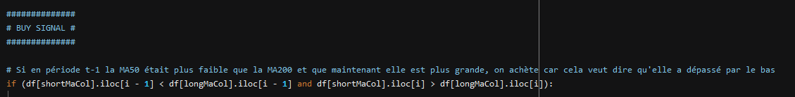
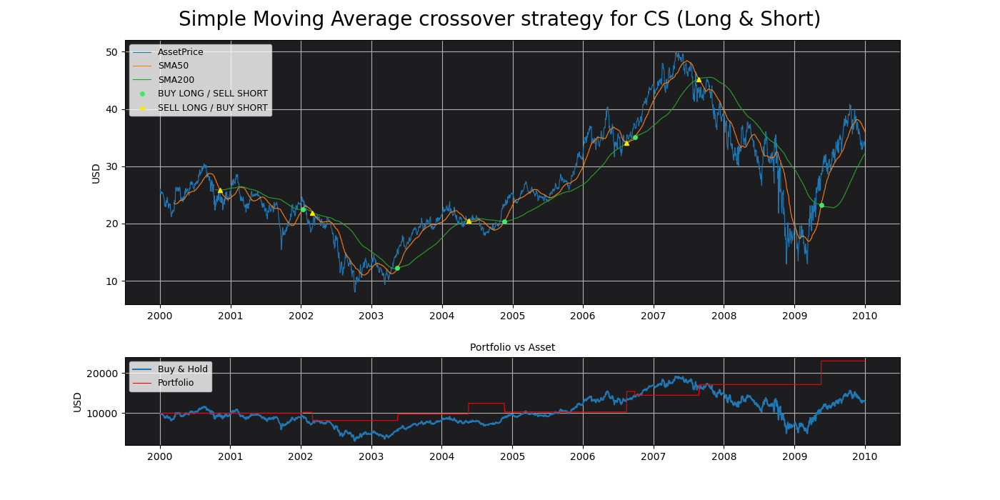
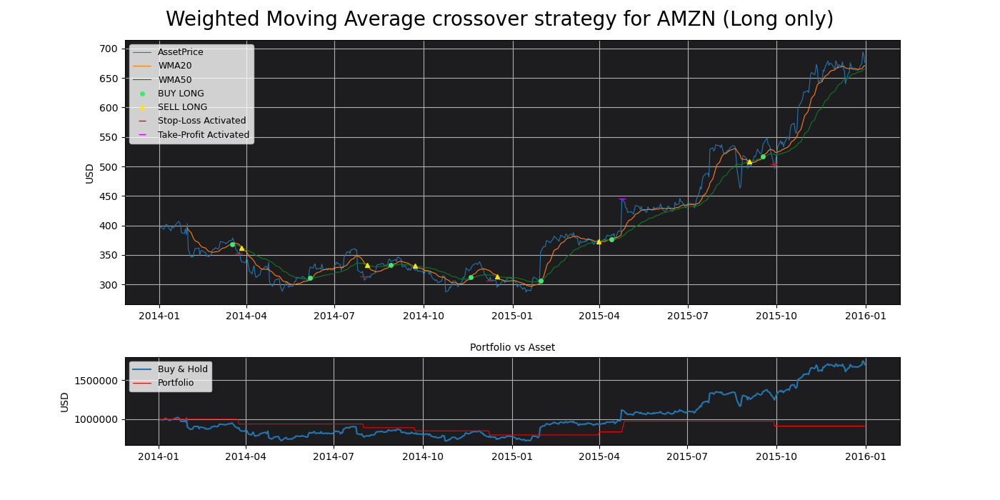

[](https://travis-ci.com/MartinsAlex/MA_Backtester)<space><space>
[](https://snyk.io/test/github/MartinsAlex/MA_Backtester?targetFile=requirements.txt)<space><space>
[](https://www.repostatus.org/#concept)


# MA_Backtester

### Un module fintech se voulant simple et intuitif tout en restant puissant. Il permet de tester la performance historique de stratégies de trading systématique, basées sur le croisement de moyenne mobile.


### Il est utilisable sur près de :

* 100'000 actions
* 120 crypto-monnaies
* 35 monnaies cotées en USD
* Nombreux autres actifs tels que des indices, futures et ETFs


<p>&nbsp;</p>
<p>&nbsp;</p>

 
> ## *“What has happened in the past will happen again. This is because Markets are driven by humans and human nature never changes.”* 
>> [Jesse Livermore](https://en.wikipedia.org/wiki/Jesse_Lauriston_Livermore)


<p>&nbsp;</p>
<p>&nbsp;</p>

# Sommaire

1. [Installation](https://github.com/MartinsAlex/MA_Backtester/blob/master/README.md#installation)
1. [Utilisation](https://github.com/MartinsAlex/MA_Backtester/blob/master/README.md#utilisation)
    + La fonction et ses arguments
    + Les tickers utilisables
    + Examples
1. Stratégies analysées


&nbsp;

# Installation

```python

pip install https://github.com/MartinsAlex/MA_Backtester/archive/master.zip
    
```
### Modules exigés :

- matplotlib
- pandas
- numpy
- pandas-datareader


&nbsp;

# Utilisation

## La fonction et ses arguments
&nbsp;
## Les tickers utilisables
&nbsp;
## Examples

### Example 1 : Crédit Suisse

#### Action Crédit Suisse, 2002 à 2010. Stratégie basée sur le croisement des moyennes mobiles simples de 50 et 200 jours. 
- Capital initial : 10'000 USD 
- Prise de position short et long

```python

import MA_Backtester as mb


stats = mb.movingAverageCrossover(["CS"], 50, 200, "2000-01-01", "2010-01-01", 
                                   maType="simple", showplot=True, shortLong="both", capital=10_000)
    
```
Les différents arguments sont expliqués dans la doc. Concernant les tickers, tout ceux de Yahoo Finance peuvent être utilisés ainsi que ceux de FRED (forex).

La fonction retourne deux tables pandas et une figure matplotlib. La première table contient différentes statistiques concernant la stratégie :


```python

stats.resultsTable

```
<table border="1" class="dataframe">
  <thead>
    <tr style="text-align: right;">
      <th></th>
      <th>From</th>
      <th>To</th>
      <th>Ticker</th>
      <th>Number of Trades</th>
      <th>Winning Trades</th>
      <th>Losing Trades</th>
      <th>Largest Winning Trade</th>
      <th>Largest Losing Trade</th>
      <th>% Profitable</th>
      <th>Expectancy</th>
      <th>Total Realized Return</th>
      <th>Buy &amp; Hold Return</th>
      <th>Asset Return %</th>
      <th>Strategy Return %</th>
      <th>Strategy Max Drawdown</th>
      <th>Asset Max Drawdown</th>
      <th>Open position</th>
      <th>Open Trade P/L</th>
      <th>Total Return</th>
      <th>Strategy Annualized Volatility</th>
      <th>Asset Annualized Volatility</th>
      <th>Used Stop-Loss</th>
      <th>Used Take-Profit</th>
      <th>Asset Sharpe Ratio</th>
      <th>Market Exposure</th>
      <th>Strategy Sharpe Ratio</th>
      <th>Asset Daily Avg Volume</th>
      <th>Avg Holding Days</th>
      <th>Initial Capital</th>
      <th>Final Capital</th>
      <th>Asset Annualized Return %</th>
      <th>Strategy Annualized Return %</th>
    </tr>
  </thead>
  <tbody>
    <tr>
      <th>1</th>
      <td>2000-01-03</td>
      <td>2009-12-31</td>
      <td>CS</td>
      <td>9</td>
      <td>6</td>
      <td>3</td>
      <td>5859</td>
      <td>-2148.08</td>
      <td>0.6667</td>
      <td>3.49751</td>
      <td>12994.8</td>
      <td>2871.65</td>
      <td>0.287165</td>
      <td>1.29948</td>
      <td>-0.550622</td>
      <td>-0.74091</td>
      <td>28.7958</td>
      <td>3794.66</td>
      <td>12999.6</td>
      <td>0.47174</td>
      <td>0.463312</td>
      <td>0</td>
      <td>0</td>
      <td>0.0523934</td>
      <td>0.913718</td>
      <td>0.0685191</td>
      <td>483259</td>
      <td>238</td>
      <td>10000</td>
      <td>22994.8</td>
      <td>0.0256171</td>
      <td>0.0870134</td>
    </tr>
  </tbody>
</table>

```python

stats.transactionTable

```
<table border="1" class="dataframe">
  <thead>
    <tr style="text-align: right;">
      <th></th>
      <th>Date</th>
      <th>Type</th>
      <th>Price</th>
      <th>Ticker</th>
      <th>P/L</th>
      <th>Number of shares</th>
      <th>Total P/L</th>
    </tr>
  </thead>
  <tbody>
    <tr>
      <th>0</th>
      <td>2000-11-08</td>
      <td>Buy Short</td>
      <td>24.747902</td>
      <td>CS</td>
      <td>NaN</td>
      <td>404</td>
      <td>NaN</td>
    </tr>
    <tr>
      <th>1</th>
      <td>2002-01-10</td>
      <td>Sell Short</td>
      <td>24.150114</td>
      <td>CS</td>
      <td>0.597788</td>
      <td>404</td>
      <td>241.506</td>
    </tr>
    <tr>
      <th>2</th>
      <td>2002-01-10</td>
      <td>Buy Long</td>
      <td>24.150114</td>
      <td>CS</td>
      <td>NaN</td>
      <td>424</td>
      <td>NaN</td>
    </tr>
    <tr>
      <th>3</th>
      <td>2002-03-01</td>
      <td>Sell Long</td>
      <td>19.280340</td>
      <td>CS</td>
      <td>-4.869774</td>
      <td>424</td>
      <td>-2064.78</td>
    </tr>
    <tr>
      <th>4</th>
      <td>2002-03-01</td>
      <td>Buy Short</td>
      <td>19.280340</td>
      <td>CS</td>
      <td>NaN</td>
      <td>424</td>
      <td>NaN</td>
    </tr>
    <tr>
      <th>5</th>
      <td>2003-05-16</td>
      <td>Sell Short</td>
      <td>15.553974</td>
      <td>CS</td>
      <td>3.726366</td>
      <td>424</td>
      <td>1579.98</td>
    </tr>
    <tr>
      <th>6</th>
      <td>2003-05-16</td>
      <td>Buy Long</td>
      <td>15.553974</td>
      <td>CS</td>
      <td>NaN</td>
      <td>627</td>
      <td>NaN</td>
    </tr>
    <tr>
      <th>7</th>
      <td>2004-05-18</td>
      <td>Sell Long</td>
      <td>19.864042</td>
      <td>CS</td>
      <td>4.310068</td>
      <td>627</td>
      <td>2702.41</td>
    </tr>
    <tr>
      <th>8</th>
      <td>2004-05-18</td>
      <td>Buy Short</td>
      <td>19.864042</td>
      <td>CS</td>
      <td>NaN</td>
      <td>627</td>
      <td>NaN</td>
    </tr>
    <tr>
      <th>9</th>
      <td>2004-11-19</td>
      <td>Sell Short</td>
      <td>23.290010</td>
      <td>CS</td>
      <td>-3.425968</td>
      <td>627</td>
      <td>-2148.08</td>
    </tr>
    <tr>
      <th>10</th>
      <td>2004-11-19</td>
      <td>Buy Long</td>
      <td>23.290010</td>
      <td>CS</td>
      <td>NaN</td>
      <td>443</td>
      <td>NaN</td>
    </tr>
    <tr>
      <th>11</th>
      <td>2006-08-15</td>
      <td>Sell Long</td>
      <td>34.777523</td>
      <td>CS</td>
      <td>11.487513</td>
      <td>443</td>
      <td>5088.97</td>
    </tr>
    <tr>
      <th>12</th>
      <td>2006-08-15</td>
      <td>Buy Short</td>
      <td>34.777523</td>
      <td>CS</td>
      <td>NaN</td>
      <td>443</td>
      <td>NaN</td>
    </tr>
    <tr>
      <th>13</th>
      <td>2006-09-27</td>
      <td>Sell Short</td>
      <td>36.907272</td>
      <td>CS</td>
      <td>-2.129749</td>
      <td>443</td>
      <td>-943.479</td>
    </tr>
    <tr>
      <th>14</th>
      <td>2006-09-27</td>
      <td>Buy Long</td>
      <td>36.907272</td>
      <td>CS</td>
      <td>NaN</td>
      <td>392</td>
      <td>NaN</td>
    </tr>
    <tr>
      <th>15</th>
      <td>2007-08-24</td>
      <td>Sell Long</td>
      <td>43.742233</td>
      <td>CS</td>
      <td>6.834961</td>
      <td>392</td>
      <td>2679.3</td>
    </tr>
    <tr>
      <th>16</th>
      <td>2007-08-24</td>
      <td>Buy Short</td>
      <td>43.742233</td>
      <td>CS</td>
      <td>NaN</td>
      <td>392</td>
      <td>NaN</td>
    </tr>
    <tr>
      <th>17</th>
      <td>2009-05-19</td>
      <td>Sell Short</td>
      <td>28.795807</td>
      <td>CS</td>
      <td>14.946426</td>
      <td>392</td>
      <td>5859</td>
    </tr>
    <tr>
      <th>18</th>
      <td>2009-05-19</td>
      <td>Buy Long</td>
      <td>28.795807</td>
      <td>CS</td>
      <td>NaN</td>
      <td>799</td>
      <td>NaN</td>
    </tr>
  </tbody>
</table>

Le dernier élément retourné est un graphique, si l'argument showplot est "True" :

```python

stats.showPlot()

```




&nbsp;
### Example 2 :

##### Action Amazon, de 2018 à 2019. Stratégie basée sur le croisement des moyennes mobiles pondérées de 20 et 50 jours. 
- Capital initial : 1'000'000 USD 
- Prise de position long only
- Stop-loss : 5 %
- Take-Profit : 10 %

```python

stats, transactions, fig = MA_CROSS(["AMZN"], 20, 50, "2014-01-01", "2016-01-01", 
                                      ma="weighted", showplot=True, shortLong="long", capital=1_000_000,
                                     stopLoss=0.05, takeProfit=0.1)
```

```python

stats

```
<table border="1" class="dataframe">
  <thead>
    <tr style="text-align: right;">
      <th></th>
      <th>From</th>
      <th>To</th>
      <th>Ticker</th>
      <th>Number of Trades</th>
      <th>Winning Trades</th>
      <th>Losing Trades</th>
      <th>Largest Winning Trade</th>
      <th>Largest Losing Trade</th>
      <th>% Profitable</th>
      <th>Expectancy</th>
      <th>Total Realized Return</th>
      <th>Buy &amp; Hold Return</th>
      <th>Asset Return %</th>
      <th>Strategy Return %</th>
      <th>Strategy Max Drawdown</th>
      <th>Asset Max Drawdown</th>
      <th>Open position</th>
      <th>Open Trade P/L</th>
      <th>Total Return</th>
      <th>Strategy Annualized Volatility</th>
      <th>Asset Annualized Volatility</th>
      <th>Used Stop-Loss</th>
      <th>Used Take-Profit</th>
      <th>Asset Sharpe Ratio</th>
      <th>Market Exposure</th>
      <th>Strategy Sharpe Ratio</th>
      <th>Asset Daily Avg Volume</th>
      <th>Avg Holding Days</th>
      <th>Initial Capital</th>
      <th>Final Capital</th>
      <th>Asset Annualized Return %</th>
      <th>Strategy Annualized Return %</th>
    </tr>
  </thead>
  <tbody>
    <tr>
      <th>1</th>
      <td>2014-01-02</td>
      <td>2015-12-31</td>
      <td>AMZN</td>
      <td>7</td>
      <td>2</td>
      <td>5</td>
      <td>62.74</td>
      <td>-34.81</td>
      <td>0.2857</td>
      <td>-4.25571</td>
      <td>-87733</td>
      <td>698344</td>
      <td>0.698344</td>
      <td>-0.087733</td>
      <td>-0.132607</td>
      <td>-0.29505</td>
      <td>0</td>
      <td>0</td>
      <td>-87733</td>
      <td>0.335705</td>
      <td>0.328757</td>
      <td>4</td>
      <td>1</td>
      <td>0.804009</td>
      <td>0.253968</td>
      <td>-0.541539</td>
      <td>3.94081e+06</td>
      <td>18</td>
      <td>1000000</td>
      <td>912267</td>
      <td>0.303205</td>
      <td>-0.0448733</td>
    </tr>
  </tbody>
</table>

```python

transactions

```
<table border="1" class="dataframe">
  <thead>
    <tr style="text-align: right;">
      <th></th>
      <th>Date</th>
      <th>Type</th>
      <th>Price</th>
      <th>Ticker</th>
      <th>P/L</th>
      <th>Number of shares</th>
      <th>Total P/L</th>
    </tr>
  </thead>
  <tbody>
    <tr>
      <th>0</th>
      <td>2014-03-17</td>
      <td>Buy Long</td>
      <td>375.040009</td>
      <td>AMZN</td>
      <td>NaN</td>
      <td>2666</td>
      <td>NaN</td>
    </tr>
    <tr>
      <th>1</th>
      <td>2014-03-24</td>
      <td>Stop-Loss Long</td>
      <td>351.850006</td>
      <td>AMZN</td>
      <td>-23.190002</td>
      <td>2666</td>
      <td>-61824.5</td>
    </tr>
    <tr>
      <th>2</th>
      <td>2014-06-06</td>
      <td>Buy Long</td>
      <td>329.670013</td>
      <td>AMZN</td>
      <td>NaN</td>
      <td>2846</td>
      <td>NaN</td>
    </tr>
    <tr>
      <th>3</th>
      <td>2014-07-31</td>
      <td>Stop-Loss Long</td>
      <td>312.989990</td>
      <td>AMZN</td>
      <td>-16.680023</td>
      <td>2846</td>
      <td>-47471.3</td>
    </tr>
    <tr>
      <th>4</th>
      <td>2014-08-28</td>
      <td>Buy Long</td>
      <td>340.019989</td>
      <td>AMZN</td>
      <td>NaN</td>
      <td>2620</td>
      <td>NaN</td>
    </tr>
    <tr>
      <th>5</th>
      <td>2014-09-22</td>
      <td>Sell Long</td>
      <td>324.500000</td>
      <td>AMZN</td>
      <td>-15.519989</td>
      <td>2620</td>
      <td>-40662.4</td>
    </tr>
    <tr>
      <th>6</th>
      <td>2014-11-19</td>
      <td>Buy Long</td>
      <td>326.540009</td>
      <td>AMZN</td>
      <td>NaN</td>
      <td>2603</td>
      <td>NaN</td>
    </tr>
    <tr>
      <th>7</th>
      <td>2014-12-08</td>
      <td>Stop-Loss Long</td>
      <td>306.640015</td>
      <td>AMZN</td>
      <td>-19.899994</td>
      <td>2603</td>
      <td>-51799.7</td>
    </tr>
    <tr>
      <th>8</th>
      <td>2015-01-30</td>
      <td>Buy Long</td>
      <td>354.529999</td>
      <td>AMZN</td>
      <td>NaN</td>
      <td>2252</td>
      <td>NaN</td>
    </tr>
    <tr>
      <th>9</th>
      <td>2015-03-31</td>
      <td>Sell Long</td>
      <td>372.100006</td>
      <td>AMZN</td>
      <td>17.570007</td>
      <td>2252</td>
      <td>39567.7</td>
    </tr>
    <tr>
      <th>10</th>
      <td>2015-04-13</td>
      <td>Buy Long</td>
      <td>382.359985</td>
      <td>AMZN</td>
      <td>NaN</td>
      <td>2191</td>
      <td>NaN</td>
    </tr>
    <tr>
      <th>11</th>
      <td>2015-04-24</td>
      <td>Take-Profit Long</td>
      <td>445.100006</td>
      <td>AMZN</td>
      <td>62.740021</td>
      <td>NaN</td>
      <td>NaN</td>
    </tr>
    <tr>
      <th>12</th>
      <td>2015-09-17</td>
      <td>Buy Long</td>
      <td>538.869995</td>
      <td>AMZN</td>
      <td>NaN</td>
      <td>1810</td>
      <td>NaN</td>
    </tr>
    <tr>
      <th>13</th>
      <td>2015-09-28</td>
      <td>Stop-Loss Long</td>
      <td>504.059998</td>
      <td>AMZN</td>
      <td>-34.809998</td>
      <td>1810</td>
      <td>-63006.1</td>
    </tr>
  </tbody>
</table>

```python

plt.show()

```


&nbsp;
### Example 3 :

##### Bitcoin, septembre 2017 à juin 2018. Stratégie basée sur le croisement des moyennes mobiles exponentielles de 8 et 13 jours. 
- Capital initial : 100'000 USD 
- Prise de position long

```python

stats, transactions, fig = MA_CROSS(["BTC-USD"], 8, 13, "2017-09-01", "2018-07-01", 
                                      ma="exp", showplot=True, shortLong="long", capital=100_000)
                                      
```

```python

stats

```

<table border="1" class="dataframe">
  <thead>
    <tr style="text-align: right;">
      <th></th>
      <th>From</th>
      <th>To</th>
      <th>Ticker</th>
      <th>Number of Trades</th>
      <th>Winning Trades</th>
      <th>Losing Trades</th>
      <th>Largest Winning Trade</th>
      <th>Largest Losing Trade</th>
      <th>% Profitable</th>
      <th>Expectancy</th>
      <th>Total Realized Return</th>
      <th>Buy &amp; Hold Return</th>
      <th>Asset Return %</th>
      <th>Strategy Return %</th>
      <th>Strategy Max Drawdown</th>
      <th>Asset Max Drawdown</th>
      <th>Open position</th>
      <th>Open Trade P/L</th>
      <th>Total Return</th>
      <th>Strategy Annualized Volatility</th>
      <th>Asset Annualized Volatility</th>
      <th>Used Stop-Loss</th>
      <th>Used Take-Profit</th>
      <th>Asset Sharpe Ratio</th>
      <th>Market Exposure</th>
      <th>Strategy Sharpe Ratio</th>
      <th>Asset Daily Avg Volume</th>
      <th>Avg Holding Days</th>
      <th>Initial Capital</th>
      <th>Final Capital</th>
      <th>Asset Annualized Return %</th>
      <th>Strategy Annualized Return %</th>
    </tr>
  </thead>
  <tbody>
    <tr>
      <th>1</th>
      <td>2017-08-31</td>
      <td>2018-07-01</td>
      <td>BTC-USD</td>
      <td>5</td>
      <td>3</td>
      <td>2</td>
      <td>7383.66</td>
      <td>-4023.7</td>
      <td>0.6</td>
      <td>968.388</td>
      <td>114540</td>
      <td>35203.7</td>
      <td>0.352037</td>
      <td>1.1454</td>
      <td>-0.290582</td>
      <td>-0.697219</td>
      <td>0</td>
      <td>0</td>
      <td>114540</td>
      <td>0.820805</td>
      <td>0.868408</td>
      <td>0</td>
      <td>0</td>
      <td>0.286721</td>
      <td>0.44918</td>
      <td>1.72643</td>
      <td>6.68216e+09</td>
      <td>27</td>
      <td>100000</td>
      <td>214540</td>
      <td>0.283</td>
      <td>0.878893</td>
    </tr>
  </tbody>
</table>

```python

transactions

```

<table border="1" class="dataframe">
  <thead>
    <tr style="text-align: right;">
      <th></th>
      <th>Date</th>
      <th>Type</th>
      <th>Price</th>
      <th>Ticker</th>
      <th>P/L</th>
      <th>Number of shares</th>
      <th>Total P/L</th>
    </tr>
  </thead>
  <tbody>
    <tr>
      <th>0</th>
      <td>2017-09-27</td>
      <td>Buy Long</td>
      <td>4174.729980</td>
      <td>BTC-USD</td>
      <td>NaN</td>
      <td>24</td>
      <td>NaN</td>
    </tr>
    <tr>
      <th>1</th>
      <td>2017-11-12</td>
      <td>Sell Long</td>
      <td>5950.069824</td>
      <td>BTC-USD</td>
      <td>1775.339844</td>
      <td>24</td>
      <td>42608.2</td>
    </tr>
    <tr>
      <th>2</th>
      <td>2017-11-15</td>
      <td>Buy Long</td>
      <td>7315.540039</td>
      <td>BTC-USD</td>
      <td>NaN</td>
      <td>19</td>
      <td>NaN</td>
    </tr>
    <tr>
      <th>3</th>
      <td>2017-12-23</td>
      <td>Sell Long</td>
      <td>14699.200195</td>
      <td>BTC-USD</td>
      <td>7383.660156</td>
      <td>19</td>
      <td>140290</td>
    </tr>
    <tr>
      <th>4</th>
      <td>2018-01-05</td>
      <td>Buy Long</td>
      <td>17429.500000</td>
      <td>BTC-USD</td>
      <td>NaN</td>
      <td>16</td>
      <td>NaN</td>
    </tr>
    <tr>
      <th>5</th>
      <td>2018-01-11</td>
      <td>Sell Long</td>
      <td>13405.799805</td>
      <td>BTC-USD</td>
      <td>-4023.700195</td>
      <td>16</td>
      <td>-64379.2</td>
    </tr>
    <tr>
      <th>6</th>
      <td>2018-02-16</td>
      <td>Buy Long</td>
      <td>10233.900391</td>
      <td>BTC-USD</td>
      <td>NaN</td>
      <td>21</td>
      <td>NaN</td>
    </tr>
    <tr>
      <th>7</th>
      <td>2018-03-08</td>
      <td>Sell Long</td>
      <td>9395.009766</td>
      <td>BTC-USD</td>
      <td>-838.890625</td>
      <td>21</td>
      <td>-17616.7</td>
    </tr>
    <tr>
      <th>8</th>
      <td>2018-04-12</td>
      <td>Buy Long</td>
      <td>7895.959961</td>
      <td>BTC-USD</td>
      <td>NaN</td>
      <td>25</td>
      <td>NaN</td>
    </tr>
    <tr>
      <th>9</th>
      <td>2018-05-10</td>
      <td>Sell Long</td>
      <td>8441.490234</td>
      <td>BTC-USD</td>
      <td>545.530273</td>
      <td>25</td>
      <td>13638.3</td>
    </tr>
  </tbody>
</table>

```python

plt.show()

```


&nbsp;
### Example 4 :

##### Analyse de 5 devises...
- Capital initial : 100'000 USD 
- Prise de position long

```python

tickerList = [DEX.., ... , ...]

stats, transactions, fig = MA_CROSS(tickerList, 8, 13, "2017-09-01", "2018-07-01", 
                                      ma="exp", showplot=False, shortLong="long", capital=100_000)
                                      
```


